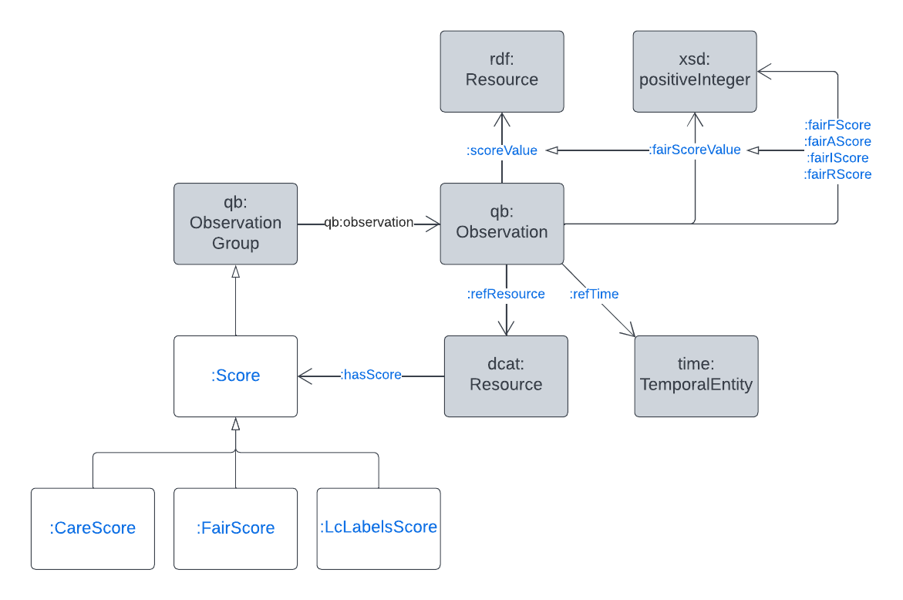

= Scores Model

This repository contains the Scoring Model, a Semantic Web / Knowledge Graph ontology, used to represent the scores of catalogued items with respect to valrious principles, such as https://www.go-fair.org/fair-principles/[FAIR] and https://ardc.edu.au/resource/the-care-principles/[CARE].

== Overview

An overview of this model's classes and properties, and their relations to common model elements is given below:

[#img-rdf]
.Overview of the Scores Model

The thing being scored is the generic `dcat:Resource` which means anything catalogued according to DCAT could have a score indicated with the `scores:hasScore` property. Note also that scores in this model, which are `qb:ObservationCollection` instances, can indicate the thing they are a score for by using a `scores:refResource` property.

== Details

This ontology is documented in full at:

* https://idn-au.github.io/scores-ont/scores.html

== Licensing & Rights

The creators and maintainers of this model wish for it to be available for use as widely as possible. The model is thus licensed using the permissive, and pretty standard, https://creativecommons.org/licenses/by/4.0/[Creative Commons BY 4.0]  license, a copy of the deed of which is in the file LICENSE.

This software is copyright as follows:

(c) Indigenous Data Network, 2022

== Contact

Please contact the Indigenous Data Network maintainers of this code for all issues:

_Lead Developer_: +
*Nicholas Car* +
GitHub: https://github.com/nicholascar[@nicholascar] +
Email: nick@kurrawong.net +

_Project Owner_: +
*Sandra Silcot* +
GitHub: https://github.com/ssilcot[@ssilcot] +

_Owner Organisation_ +
*Indigenous Data Network* +
https://idnau.org